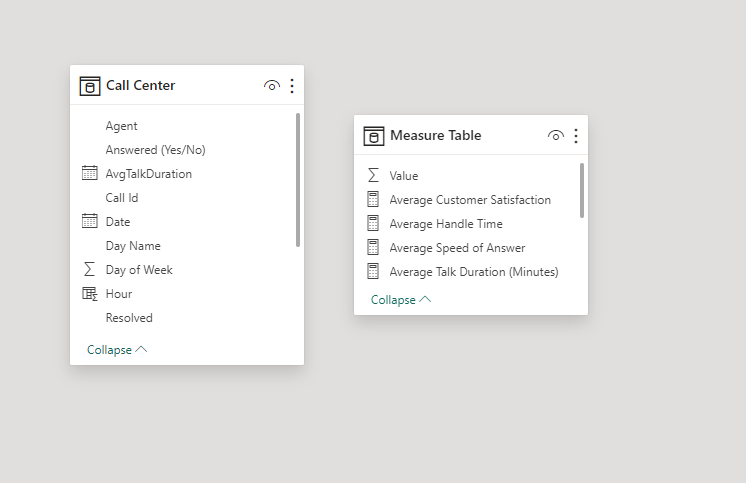
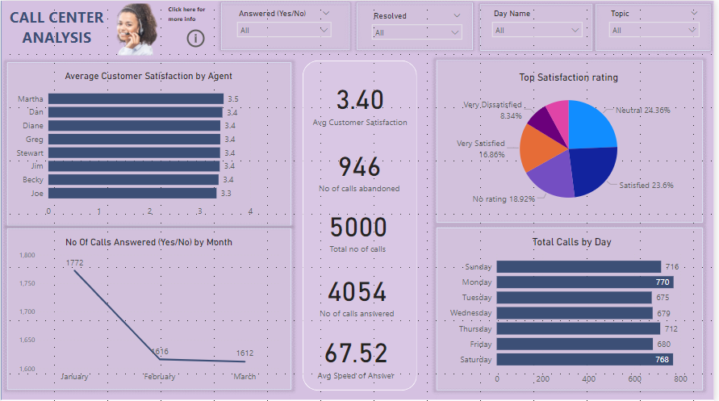
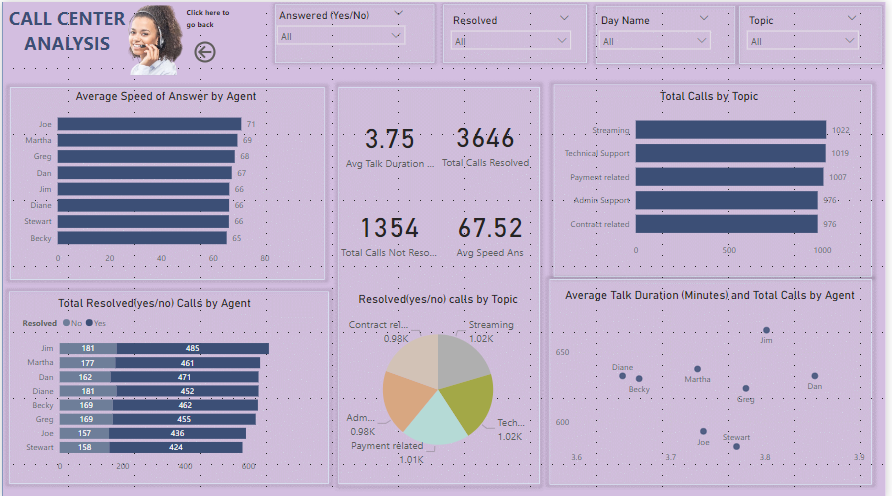

# Call Center Analysis

## Introduction: 
 This Power BI project on Call center Analysis. The dataset contains the Call Id, Agent, Date, Time, Topic, Answered (Y/N), Resolved, Speed of answer in seconds, AvgTalkDuration and Satisfaction rating.

## Content:
_The dataset contains the following fields:_
- Call Id: The identification number for received calls.
- Agent: The names of agents handling the calls.
- Date: The date when the calls were received.
- Time: The time when the calls were made.
- Topic: The issue addressed during the calls.
- Answered (Y/N): Indicates if the call was answered (Y for Yes, N for No).
- Resolved: Indicates if the call was resolved (Y for Yes, N for No).
- Speed of Answer in Seconds: The time interval at which the call was answered.
- AvgTalkDuration: The average time spent on calls.
- Satisfaction Rating: The satisfaction rating given by customers to the agents.

# Skills/ concepts demonstrated:
## The following Power BI features were incorporated:
Data cleaning,  Data Abstraction, DAX, Modelling, slicers.
### Data cleaning: 
1. I changed the data types to the correct and appropriate data types.
2. I change the column with answered Y/N to  Y = Yes and N = No for better and easy understanding
3. I did the same thing to resolved column Y to Yes  and N to No.

### Data Abstraction: 
I added another column by extracting the day name and day of weeks from the date column.

### DAX: 
I Created an empty table called measure table using this formular Measure Table = GENERATESERIES(1,1) This table is to hold all the measures I am going to be creating to avoid by work been jampad together. The following are the measures I created:
1. Average Customer Satisfaction = AVERAGE('Call Center'[Satisfaction rating])
2. Average Handle Time = AVERAGE('Call Center'[AvgTalkDuration])
3. Average Speed of Answer = AVERAGE('Call Center'[Speed of answer in seconds])
4. Number of calls abandoned = CALCULATE(COUNTROWS('Call Center'), 'Call Center'[Answered (Y/N)]="N")
5. Number of calls answered = CALCULATE(COUNTROWS('Call Center'),'Call Center'[Answered (Y/N)] = "Y")
6. Total Calls Not Resolved = COUNTROWS(FILTER('Call Center', 'Call Center'[Resolved] = "N"))
7. Total Calls Resolved = COUNTROWS(FILTER('Call Center', 'Call Center'[Resolved] = "Y"))
8. Average Talk Duration (Minutes) = [Average Talk Duration (Seconds)] / 60
9. Average Talk Duration (Seconds) = AVERAGE('Call Center'[TotalSeconds])
10. Count of Calls = COUNT('Call Center'[Call Id])

# Problem statement:
1. Overall customer satisfaction
2. Overall calls answered/abandoned
3. Calls by time
4. Average speed of answer
5. Agent’s performance quadrant -> average handle time (talk duration) vs calls answered.

_And I also created a calculated columns by adding a new column in the modelling tab. Theses are the formular below:_
1. Hour = HOUR('Call Center'[Time])
2. TotalSeconds = (HOUR('Call Center'[AvgTalkDuration]) * 3600) +(MINUTE('Call Center'[AvgTalkDuration]) * 60) +
SECOND('Call Center'[AvgTalkDuration]).

# Modelling:
There is only one table with a measure table i created in order to helps to structure my data model efficiently, providing clear, organized, and optimized calculations for analysis.
The model is a Fact Table with Measures Model. 

# Visualization:
## This report comprises two pages:
### Page 1: Customer Satisfaction and Call Volume Analysis

_Visuals on the Page_
1.	Average Customer Satisfaction by Agent
2.	Top Satisfaction Rating
3.	Total Calls by Day
4.	Number of Calls Answered by Month

# Insights
1. Average Customer Satisfaction by Agent:
•	Insight: The average customer satisfaction scores are relatively close, with the highest being 3.5 and the lowest 3.3. Most agents have a score of 3.4.
•	Recommendation: Focus on small improvements in customer interactions to raise the overall satisfaction scores. Consider training sessions or workshops to share best practices among agents, especially those scoring 3.5.
2. Top Satisfaction Rating:
•	Insight: The highest satisfaction rating category is "Satisfied" at 23.6%, followed by "Neutral." "Very Dissatisfied" is the least common rating.
•	Recommendation: Analyze the factors contributing to the "Satisfied" and "Neutral" ratings to replicate successful strategies. Address the issues leading to "Dissatisfied" and "Very Dissatisfied" ratings through targeted feedback and process improvements.
3. Total Calls by Day:
•	Insight: Saturday has the highest call volume, followed by Monday, with Friday having the least number of calls.
•	Recommendation: Schedule more agents to work on Saturdays and Mondays to handle the higher call volumes. Consider offering incentives for agents willing to work on weekends.
4. Number of Calls Answered by Month:
•	Insight: January has the highest number of answered calls at 1,772, followed by February at 1,616, and March at 1,612. January accounts for 35.44% of the total answered calls.
•	Recommendation: Investigate the reasons for the high call volume in January and adjust staffing levels accordingly. Ensure adequate staffing in other months to maintain high service levels.

# General Recommendations
1.	Staff Training and Development:
o	Conduct regular training sessions focused on improving customer satisfaction. Use the insights from high-performing agents to guide these sessions.
o	Provide personalized coaching to agents with lower satisfaction scores to help them improve.
2.	Customer Feedback Analysis:
o	Regularly review customer feedback to identify common issues and areas for improvement. Implement changes based on this feedback to enhance customer satisfaction.
3.	Resource Allocation:
o	Adjust staffing schedules based on call volume trends. Ensure that more agents are available during peak times, such as weekends and the beginning of the year.
o	Consider flexible staffing solutions, like part-time or temporary workers, to manage fluctuations in call volume.
4.	Incentive Programs:
o	Implement incentive programs to reward agents who achieve high customer satisfaction scores and handle a high volume of calls effectively.
o	Recognize and reward agents who work during peak times and contribute significantly to managing high call volumes

# Page 2: Agent and Topic Performance Analysis

_Visuals on the Page_
1.	Average Speed of Answer by Agent
2.	Total Resolved (Yes/No) Calls by Agent
3.	Total Resolved (Yes/No) Calls by Topic
4.	Total Calls by Topic
5.	Average Talk Duration (Minutes) and Total Calls by Agent

# Insights
1. Average Speed of Answer by Agent:
•	Insight: Joe has the highest average speed of answer at 70.99 seconds, which is 8.66% higher than Becky, who has the lowest at 65.33 seconds.
•	Recommendation: Investigate Joe's techniques and methods to share best practices across all agents. Consider additional training for agents with slower response times to improve their efficiency.
2. Total Resolved (Yes/No) Calls by Agent:
•	Insight: There are more resolved calls marked as "Yes" (3,646) compared to "No" (1,354). Jim accounts for 9.70% of resolved "Yes" calls.
•	Recommendation: Recognize and reward agents like Jim who contribute significantly to resolved calls. Analyze the reasons for unresolved calls and provide targeted training or resources to reduce these numbers.
3. Total Resolved (Yes/No) Calls by Topic:
•	Insight: Streaming and technical support both have the highest number of resolved calls at 1.02k, while contract-related and admin support topics have the lowest at 0.98k.
•	Recommendation: Ensure that agents handling contract-related and admin support topics have adequate training and resources. Consider a deeper analysis to understand why these topics have fewer resolved calls and address any underlying issues.
4. Total Calls by Topic:
•	Insight: Streaming (1,022) and technical support (1,019) have the highest number of calls, followed by payment-related issues (1,007). Contract-related and admin support topics have the lowest call volumes (976).
•	Recommendation: Allocate resources and specialized training for agents handling high-volume topics like streaming and technical support. This will help improve efficiency and customer satisfaction in these areas.
5. Average Talk Duration (Minutes) and Total Calls by Agent:
•	Insight: Dan has the highest average talk duration (3.85 minutes), while Jim has the highest count of calls (666).
•	Recommendation: Evaluate Dan's long call durations to ensure they are necessary for effective resolution. Jim's high call count should be analyzed for efficiency without compromising service quality. Balance between talk duration and call resolution effectiveness should be maintained.

# General Recommendations
1.	Best Practices Sharing:
o	Identify and share successful techniques used by top-performing agents like Joe and Jim with the rest of the team to enhance overall performance.
2.	Targeted Training:
o	Provide additional training and resources for agents with slower response times or lower resolution rates. Focus on the specific needs of topics with lower resolution rates.
3.	Performance Recognition:
o	Implement recognition and reward programs for agents who consistently perform well in terms of speed, resolution, and call volume.
4.	Continuous Monitoring:
o	Regularly monitor key metrics like average speed of answer, talk duration, and call resolution rates to identify trends and areas for improvement. Use this data to make informed staffing and training decisions.

# You can interact with the report ➡️ [here](https://app.powerbi.com/view?r=eyJrIjoiNWM4OTFiYzYtOTA4OC00ZGJlLTkxYWQtZjRjNGFlNWEyOWEwIiwidCI6ImNmNWM0NWEwLTcyOGItNDE1OC05NTY5LWQyZjNjYWI2NDJjNyJ9)

_THANK YOU_ 😄

